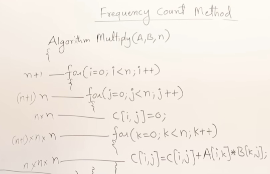

## Introduction to algorithm

**Algoriithm**: 
* "**A step by step procedure for a solving a computational problem**"
* This is the fundamental definition everyone should know.

**Algorithm vs. Program: Key Differences**
| **Algorithm** | **Program** |
|---------------|-------------|
|Design the logic and procedure to solve a problem | Implement the designed solution code. |
| Created during the Design Phase of the SDLC | Created during the implementation phase of the SDLC.

Some Terms in algorithm:
1. **Algorithm :** The design-time, abstract, step by step logic for solving a problem, written in pseudocode. Focus is on correctness and efficiency analysis. Hardware / OS independent.
2. **Program :** The implementation time, concrete translation of the algorithm into a specific programming language. Focus is on functional testing. Hardware/ OS dependent.
3. **Pseudocode**: The language of algorithm - clear, logical, human-readable, often C-like for famlilarity, independent of execution environment.
4. **Design First**: Algorithm are the essential design blueprint created before coding to ensure a correct, efficient, and well understood solution. 

## Charateristics of Algorithm:
1. Input: There is 0 or more input
2. Output: there is alteast one output
3. Definitness : Every step must be clear, precise, and have only one interpretation. Humans and computers must execute it exactly as intended. No vague or impossible instruction.
4. Finitness: The algorithm must terminate after a finite nnumber of steps
5. Effectiveness : Every step must be basic, executable, and necessary. No superfluous actions


## How to write and anlayze algorithm
Algorithm for swaping valuw in a and b.
```
begin
  temp <- a
  a <- b
  b <- temp
end
```

### How to analyze alogrithm 
1. Time : An algorithm has time functions which can scale or change according to the size or over time it can be analyzed based on time function.
2. Space : It is space used by the algorithm
3. Network consumption : How much data will be transfered by network.
4. Power Consumption
5. CPU Registers : when disgning algorithm for a low level applications no. of CPU registers used also matters.

Calculating Time:
```cpp
\\ Algorithm swap
{
  temp = a;
  a = b;
  b  = a;
}
```

Every line of command or statement is taken as 1 unit time. 
so the time functions is : **f(n) = 3**

Calculating Space:
Taking the same algorithm to swap variable.
There are three variable and each varible is taken as one word.
Therefore, Space compellxity Function: **S(n) = 3**

## Frequency  Count Method
Example : 
What does the alg do: To find the sum of elements in the array 
Algorithm of sum (A, n)
Array has five elements, so `n = 5`
```cpp
{
  s = 0
  for {i = 0; i < n; i++}{
    s = s + A[i]
  }
  return s;
}
```
calculating time fxn for the alg step by step.
1. `s = 0` counts as 1 statement -> 1
2. for loop runs `n` times (in this case runs for 5 times whch = to n) successfully but the at last attempt when tries to run again the condition is false and the loop breaks. So total no. times loop was run was `n + 1`
3. The statement inside the loop also runs for `n` no. of times. -> `n`
4. `return s` counts as a statement.

So time funcition is, `f(x) = 1 + n + 1 + n + 1 = 2n + 3`

Degree of polynomial is 1. So it is order of n ==> O(n)

**Space complexity**:
1. There are `n` of elements in the array --> n
2. And there are three variables n, s, i -> 3

So, space complecity is S(n) = `n + 3`

Example 2:
Adds n no. of 3x3 matrices
Algorithm add (A, B, n)
```cpp
for (i = 0; i < n; i++){ // n + 1
  for (j = 0; j < n; j++){ // n * (n+1)
    c[i, j] = A[i, j] + B[i, j]; // n * n
  }
}
```

Total Time Complexity: $2n^2 + 2n + 1$
Order of $n^2$ --> O($n^2$)

Space Complexity:
The variables used:
1. ABC are matrices 3x3
   A -> $n^2$
   B -> $n^2$
   C -> $n^2$
2. There are three variables `i, j, n` which are taken as one word.
So, space complexity is : $3n^2 + 3$

Example 3:
the alg multiplies n no. of matrices


Time Complexity : `f(x) = $2n^3 + 3n^2 + 2n + 1$`
Order of $n^3$ -> O($n^3$)

Space Complexity:
A -> $n^2$
B -> $n^2$
C -> $n^2$
n -> 1
i -> 1
j -> 1
k -> 1

Space Time complexity = `S(n) = $3n^2 + 4$`
Order of $n^3$ -> O($n^2$)


