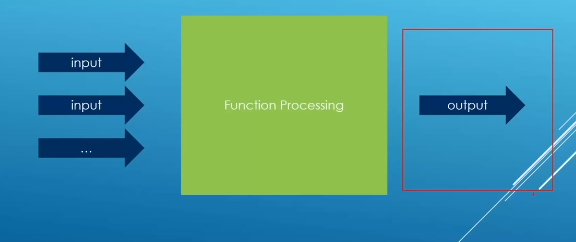

# Getting things out of functions


## Input and Output
1. Return value:
```cpp
std::string getWinner(const std::string& player1, const std::string& player2) {
    return (player1 > player2) ? player1 : player2;
}
```
* comparing two players' scores/names and returning the winner.
* Cleanest because you only need one result.

2. Pass by Reference
```cpp
void getRectangleData(double width, double height,
                      double& area, double& perimeter) {
    area = width * height;
    perimeter = 2 * (width + height);
}
```
Use Case:
* Geometry calculator where you need multiple results.
* References ensures variables are updated directly without extra return structs
* Safe (can't be null) and efficient


## Pass by Pointers
```cpp
bool findUserById(int id, User* output) {
    if (id == 101) {          // Found a user
        *output = User("Alice", 25);
        return true;
    }
    return false;             // Not found
}
```

Use Case:
1. Database lookup: You might not find the user.
2. Caller can pass a pointer, and the function it only if user exists 
3. nullptr indicates failure/no data.


